# 计算机毕业设计之Python+Scrapy+Vue.js机器学习招聘推荐系统 招聘可视化 招聘大数据 招聘数据分析(50W数据量)

## 要求
### 源码有偿一套(论文 PPT 源码+sql脚本)
### 
### 加好友前帮忙start一下，并备注github有偿获取源码
### 我的QQ号是2877135669 或者 1679232425
### 加qq好友说明（被部分  网友整得心力交瘁）：
    1.加好友务必按照格式备注
    2.避免浪费各自的时间

## 开发技术
Scrapy、Python、MySQL、协同过滤算法、机器学习、OCR识别

## 创新点

1.爬取智联招聘10多个城市的50万条就业数据后，进行转化和清洗，存储到mysql数据库；
2.职位推荐与分析
3.利用Flask开发接口，对接Vue前端，实现对求职招聘数据的可视化分析（Echarts 多种图形和词云、薪酬分析）
亮点：
1.实现的分析图：数据大屏、职位分布中国地图、薪酬散点图、词云、多种折线图、饼图、环图等 （Vue集成 Apache Echarts）； 实现jieba分词+词云

推荐算法： 两种协同过滤推荐算法使用(基于用户、基于物品)
身份证Ocr 识别

## 补充说明
适合大数据毕业设计、数据分析、爬虫类计算机毕业设计

# 运行截图

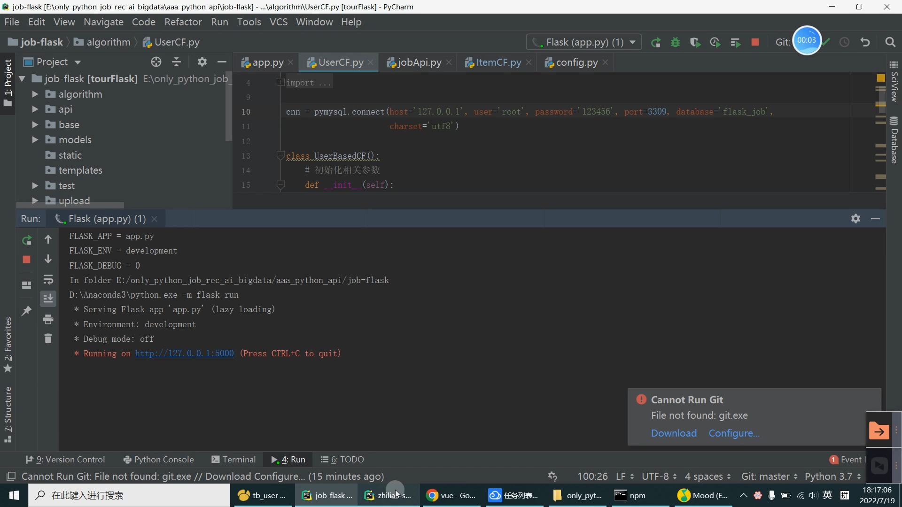

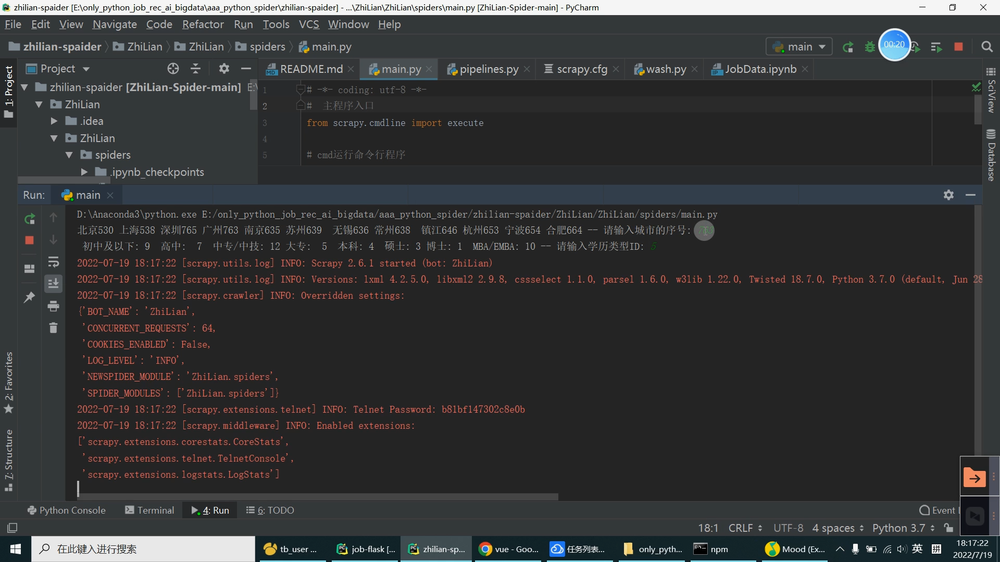

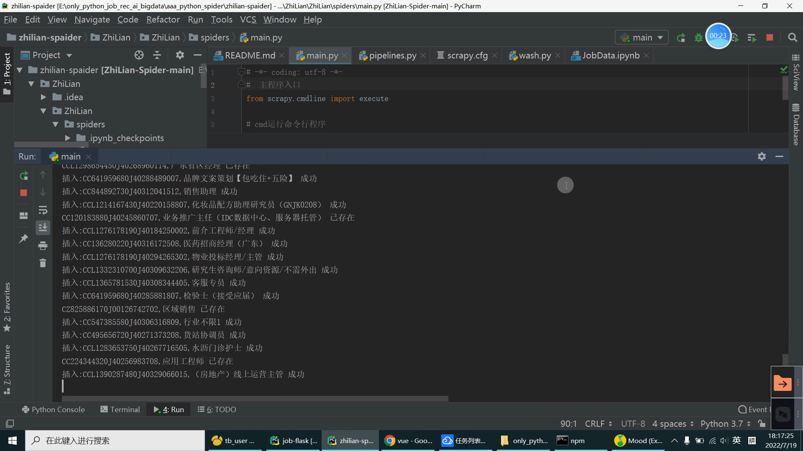

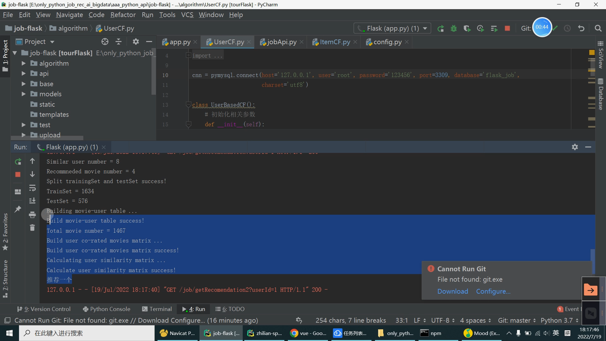

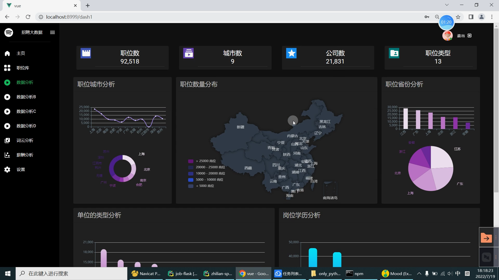

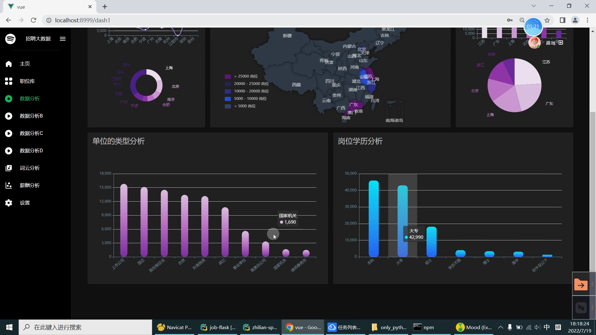

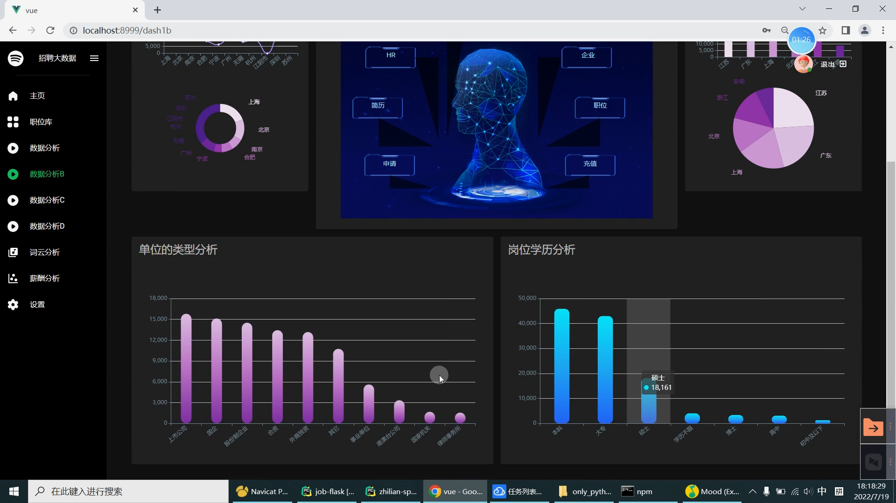

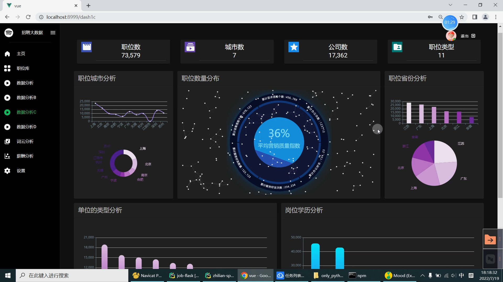

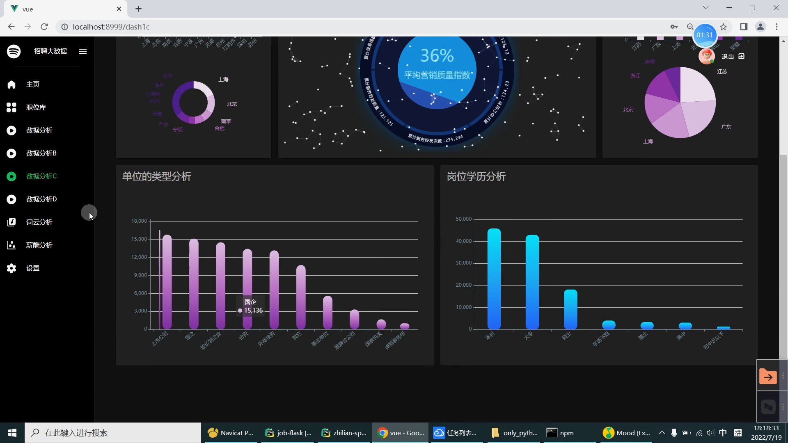

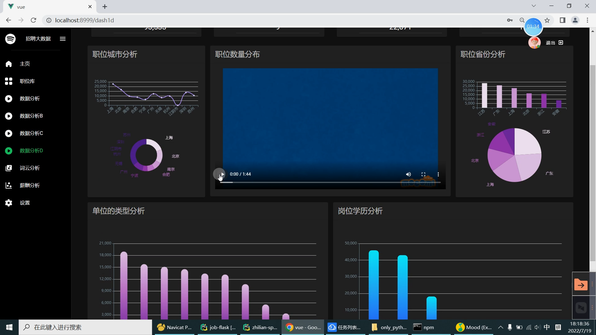

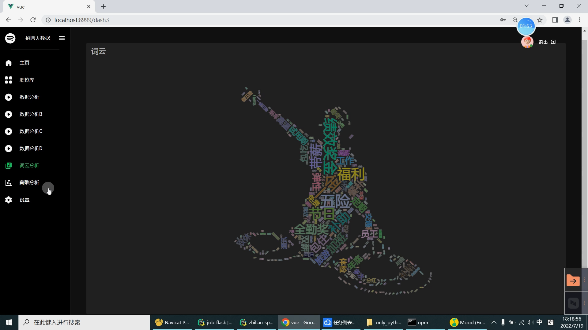

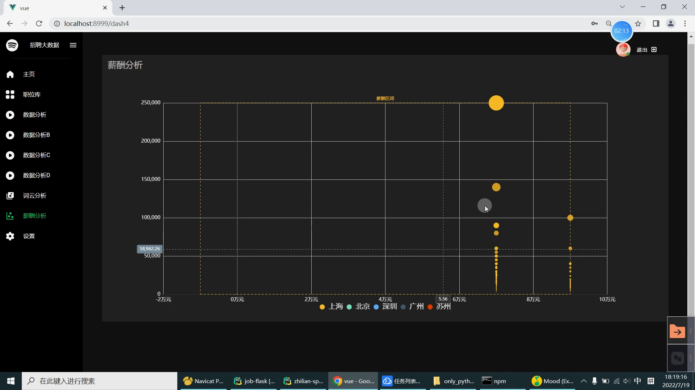

